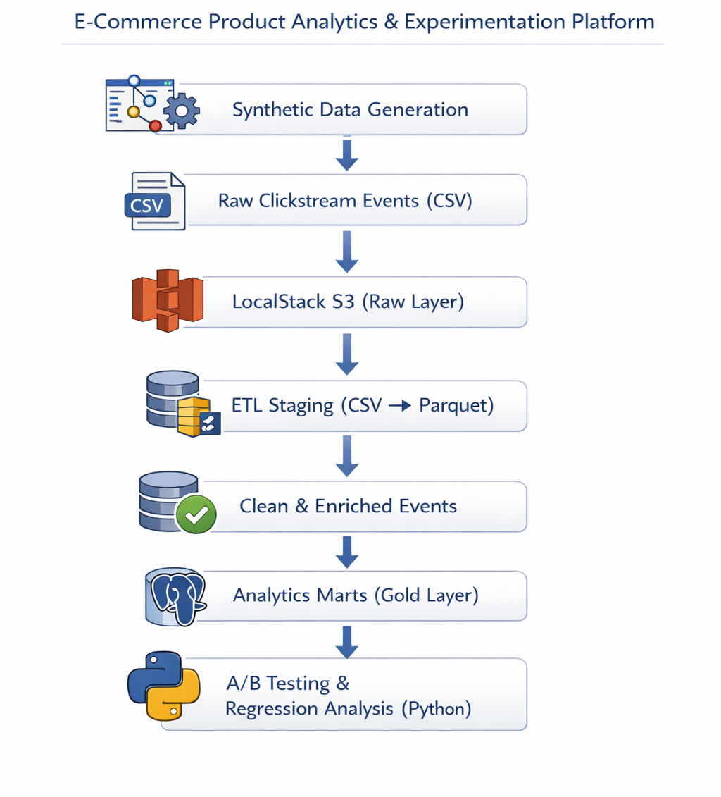

# E-Commerce Product Analytics & Experimentation Platform

## Overview

This project implements an **end-to-end product analytics and experimentation platform** for an e-commerce funnel.  
It simulates realistic user behavior, processes raw clickstream data through a layered analytics pipeline, and applies statistical experimentation techniques to evaluate the impact of a **Product Detail Page (PDP) redesign**.

The platform mirrors how modern product analytics teams operate — from **raw event ingestion** to **analytics marts**, **A/B testing**, and **data-driven product decisions**.

---

## Business Problem

Product teams often ship UI changes without clear evidence of business impact.  
This project was built to answer:

- Does a redesigned PDP increase purchase conversion?
- Is the observed improvement statistically meaningful?
- What behavioral factors actually drive conversion?
- How should product decisions be informed by data rather than intuition?

---

## High-Level Architecture




The architecture cleanly separates **data generation**, **processing**, and **analysis**, enabling reproducibility and decision-focused analytics.

---

## Data Model

### Core Datasets

The platform models **five core datasets**, representing a realistic e-commerce analytics schema:

| Table | Description |
|------|-------------|
| `users` | User metadata (device type, geo, signup timestamp) |
| `products` | Product catalog with base prices |
| `sessions` | User sessions with start/end timestamps |
| `experiment_assignments` | User-level A/B experiment assignments |
| `events` | Raw clickstream events (views, cart, checkout, purchase) |

---

## Analytics Marts (Gold Layer)

### `user_exposure`

- One row per user  
- First PDP exposure timestamp  
- Experiment variant  

### `user_outcomes`

- One row per user  
- Purchase indicator  
- Revenue  
- Engagement intensity (event count within outcome window)  
- Experiment variant  

These marts are **decision-ready datasets**, optimized for experimentation and statistical analysis.

---

## Metrics Tracked

### Primary Metric (Decision Metric)

**Purchase Conversion Rate**


This metric directly reflects business value and is used for experiment decisions.

---

### Secondary Metrics

- Revenue per user
- Funnel progression:
  - Product view → Add to cart → Checkout → Purchase

---

### Diagnostic Signals

- Engagement intensity within outcome window
- Event frequency per user
- Behavioral activity beyond exposure

---

## Experiment Design

- **Experiment**: PDP Redesign  
- **Randomization Unit**: User  
- **Variants**: Control / Treatment (50-50 split)  
- **Outcome Window**: 7 days  
- **Exposure Event**: Product view  

---

## Statistical Analysis

### A/B Testing

- Two-proportion z-test
- 95% confidence intervals
- Conversion lift estimation

---

### Regression Analysis

Logistic regression model:


This metric directly reflects business value and is used for experiment decisions.

---

## Key Findings

- The treatment group showed a **small positive lift** in conversion, but it was **not statistically significant**.
- **User engagement intensity** was a strong and statistically significant predictor of purchase.
- Engagement effects **outweighed the PDP redesign alone**.

**Conclusion:**  
Improving engagement mechanics may drive more impact than UI changes in isolation.

---

## Tech Stack

- **Language**: Python  
- **Storage**: S3 (LocalStack), Parquet  
- **Database**: Postgres  
- **Data Processing**: Pandas  
- **Statistics**: SciPy, StatsModels  
- **Infrastructure**: Docker, LocalStack  

---

## How to Run the Project

### 1. Start Infrastructure

```bash
docker compose up -d
## Generate Synthetic Data

Run the following scripts to create realistic e-commerce datasets, including users, products, sessions, experiment assignments, and clickstream events.

```bash
python data_generation/generate_users.py
python data_generation/generate_products.py
python data_generation/generate_sessions.py
python data_generation/generate_experiment_assignments.py
python data_generation/generate_events.py


## Create S3 Buckets (LocalStack)
.\infrastructure\localstack\create_buckets.ps1

## Run ETL Pipeline
Execute the end-to-end ETL pipeline to stage data, clean events, build analytics marts, and load them into Postgres.
python -m etl.run_all_stage
python -m etl.raw_to_clean_events
python -m etl.build_marts
python -m etl.load_marts_to_postgres

## Run Analysis
python -m analysis.ab_analysis
python -m analysis.regression_analysis
```
### Outputs
- Analytics marts stored in Parquet and Postgres
- A/B test results with conversion lift and confidence intervals
- Regression model explaining behavioral drivers of purchase
- Decision-ready datasets for product evaluation

### Key Takeaways
- Strong analytics foundations matter more than surface-level metrics
- Behavioral engagement can dominate UI treatment effects
- Experimentation requires statistical rigor and product context
- Clean data modeling enables trustworthy decision-making


